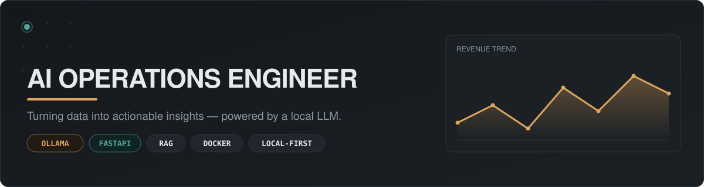
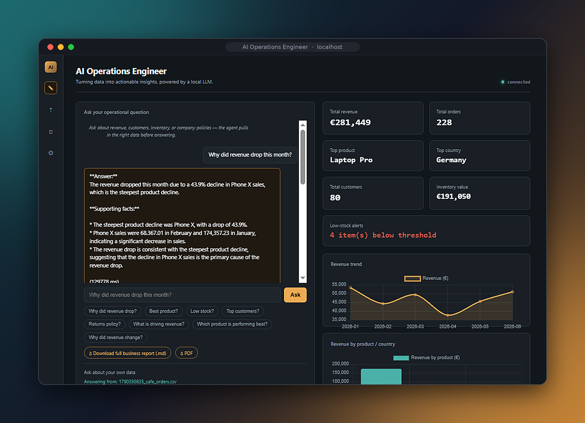

# AI Business Operations Dashboard



> **A full-stack, AI-powered business intelligence and operations platform for turning raw business data into actionable insights.**

## Overview

**AI Business Operations Dashboard** is a full-stack analytics platform designed to help businesses understand sales, revenue, customers, products, and inventory from a single operational workspace.

Instead of requiring users to manually inspect spreadsheets or write database queries, the platform combines:

* 📊 Interactive business dashboards
* 🤖 A natural-language AI business assistant
* 📈 Revenue and sales analytics
* 📦 Inventory monitoring and low-stock alerts
* 👥 Customer analytics
* 📁 CSV/data ingestion
* 📄 Automated reports and PDF reporting
* 🔌 REST APIs with OpenAPI/Swagger documentation
* 🧠 Local LLM integration through Ollama
* 🗃️ Dataset activation and management
* 🔐 Authentication and administrative endpoints

The goal is to provide a practical **"ask your data"** experience while keeping the architecture suitable for further development into a production business intelligence application.


## What the Project Does

The application follows a simple business-data workflow:

```text
                 ┌─────────────────────┐
                 │   Business Dataset  │
                 │      CSV / Data     │
                 └──────────┬──────────┘
                            │
                            ▼
                 ┌─────────────────────┐
                 │   Data Ingestion    │
                 │ Validation / Load   │
                 └──────────┬──────────┘
                            │
                            ▼
                 ┌─────────────────────┐
                 │ Analytics & Storage │
                 │ Sales / Inventory   │
                 │ Customers / Products│
                 └───────┬─────┬───────┘
                         │     │
              ┌──────────┘     └──────────┐
              ▼                           ▼
    ┌───────────────────┐       ┌───────────────────┐
    │ Business Dashboard│       │   AI Assistant    │
    │ KPIs / Charts     │       │ Natural Language  │
    │ Trends / Alerts   │       │ Business Queries  │
    └─────────┬─────────┘       └─────────┬─────────┘
              │                           │
              └─────────────┬─────────────┘
                            ▼
                  ┌─────────────────────┐
                  │ Actionable Insights │
                  │ Reports / Decisions │
                  └─────────────────────┘
```

---

## Key Features

### 📊 Business Intelligence Dashboard

The dashboard provides a centralized operational view of important business metrics, including:

* Total revenue
* Total orders
* Total customers
* Inventory value
* Low-stock items
* Top-performing products
* Revenue trends
* Product revenue comparison
* Country/market information

This gives users a quick way to understand the current state of the business without manually processing raw data.

### 🤖 AI Business Assistant

The platform includes a natural-language chat interface that allows users to ask operational questions about the active dataset.

Example questions:

```text
Which products have less than 8 units in stock?

Why did revenue change this month?

Which product generated the most revenue?

Which customers are buying the most?

What products need to be restocked?

Which category is performing best?

What is driving the current revenue trend?
```

The assistant returns an answer together with supporting information from the underlying business dataset.

### 🧠 Local LLM Integration

The project is designed to work with a locally hosted language model through **Ollama**.

This provides a local AI workflow where business-data questions can be processed without requiring every query to be sent to a hosted third-party AI API.

The architecture can be extended later to support additional models or cloud AI providers.

### 📦 Inventory Intelligence

The dashboard monitors inventory and highlights products below the configured stock threshold.

This enables operational questions such as:

* Which products are running low?
* What should be restocked?
* How many units remain?
* Which products have the greatest inventory value?

### 📈 Sales & Revenue Analytics

The analytics layer provides business-level summaries and visualizations for:

* Revenue
* Orders
* Product performance
* Sales trends
* Customer activity
* Market/country information

### 👥 Customer Analytics

Customer-level summaries can be generated from the uploaded dataset, allowing the application to support questions about customer activity, purchasing behavior, and sales contribution.

### 📁 Dataset Management

The application supports a dataset workflow rather than relying on a single hard-coded data source.

Available functionality includes:

* Upload dataset
* Upload business data
* Retrieve the active dataset
* Activate/deactivate dataset
* Run analytics against the active dataset

### 📄 Reporting

The backend exposes report endpoints for generating structured business reports and PDF output.

This creates a bridge between interactive analytics and downloadable business reporting.

### 🔌 REST API

The backend exposes documented API endpoints for the main application features.

Current endpoint groups include:

| Method   | Endpoint                 | Purpose                     |
| -------- | ------------------------ | --------------------------- |
| `GET`    | `/api/health`            | Application health check    |
| `GET`    | `/api/health/ollama`     | AI/LLM health check         |
| `GET`    | `/api/metrics`           | Application metrics         |
| `POST`   | `/api/auth/register`     | User registration           |
| `POST`   | `/api/auth/login`        | Authentication              |
| `GET`    | `/api/auth/me`           | Current-user information    |
| `GET`    | `/api/sales-summary`     | Sales summary               |
| `GET`    | `/api/customer-summary`  | Customer summary            |
| `GET`    | `/api/inventory-summary` | Inventory summary           |
| `GET`    | `/api/report`            | Business report             |
| `GET`    | `/api/report.pdf`        | PDF report                  |
| `GET`    | `/api/advanced/health`   | Advanced health information |
| `GET`    | `/api/alerts`            | Operational alerts          |
| `POST`   | `/api/chat`              | AI business assistant       |
| `GET`    | `/api/admin/chat-logs`   | Administrative chat logs    |
| `POST`   | `/api/data/upload`       | Data upload                 |
| `GET`    | `/api/dataset/active`    | Retrieve active dataset     |
| `DELETE` | `/api/dataset/active`    | Deactivate dataset          |
| `POST`   | `/api/dataset/upload`    | Upload dataset              |

> Endpoint availability can change as the application evolves. The FastAPI OpenAPI documentation is the source of truth for the running version.

---

## API Documentation

Because the backend is built with FastAPI, the application automatically exposes interactive API documentation.

When the server is running, open:

```text
http://127.0.0.1:8000/docs
```

The OpenAPI specification is also available at:

```text
http://127.0.0.1:8000/openapi.json
```

This makes it possible to test API endpoints directly from the browser and makes the backend easier to integrate with other clients.

---

## Technology Stack

### Backend

* **Python**
* **FastAPI**
* REST API architecture
* OpenAPI / Swagger documentation
* Authentication endpoints
* Data processing and analytics

### AI

* **Ollama**
* Locally hosted LLM
* Natural-language business-data querying
* AI-assisted operational analysis

### Data

* CSV-based data ingestion
* Structured business datasets
* Dataset activation/deactivation workflow
* Sales, customer, inventory, and product analytics

### Frontend / Visualization

* Interactive web dashboard
* KPI cards
* Revenue trend visualization
* Product performance visualization
* Operational alert panels
* AI chat interface

### Reporting

* Business reports
* PDF report endpoint
* Downloadable reporting workflow

---

## Project Architecture

A simplified architecture looks like this:

```text
┌─────────────────────────────────────────────────────┐
│                    Web Dashboard                    │
│                                                     │
│ KPIs │ Charts │ Inventory │ Alerts │ AI Assistant  │
└───────────────────────┬─────────────────────────────┘
                        │ HTTP / REST
                        ▼
┌─────────────────────────────────────────────────────┐
│                    FastAPI API                      │
│                                                     │
│ Auth │ Analytics │ Chat │ Reports │ Dataset │ Admin│
└───────────────┬───────────────────────┬─────────────┘
                │                       │
                ▼                       ▼
      ┌──────────────────┐     ┌────────────────────┐
      │ Data / Analytics │     │    Local LLM        │
      │                  │     │      Ollama         │
      │ Sales            │     │                    │
      │ Inventory        │     │ Natural Language   │
      │ Customers        │     │ Business Queries   │
      │ Products         │     └────────────────────┘
      └─────────┬────────┘
                │
                ▼
      ┌──────────────────┐
      │ Business Dataset │
      │ CSV / Database   │
      └──────────────────┘
```

---

## Example AI Interaction

A user can ask:

> **"From the uploaded cafe orders CSV, which categories have fewer than 8 units?"**

The application can analyze the active dataset and return an answer with supporting calculations.

Example:

```text
Answer:
The products with fewer than 8 units are:

- Pastry — 12 units
- Coffee — 8 units
- Sandwich — 6 units

Supporting calculation:
Pastry + Coffee + Sandwich = 26 units
```

The important part of this workflow is that the user interacts with business data using natural language rather than manually querying the underlying dataset.

---

## Data Pipeline

```text
CSV Upload
    │
    ▼
Validation
    │
    ▼
Dataset Processing
    │
    ▼
Active Dataset
    │
    ├──────────────► Dashboard KPIs
    │
    ├──────────────► Sales Analytics
    │
    ├──────────────► Customer Analytics
    │
    ├──────────────► Inventory Analytics
    │
    ├──────────────► Alerts
    │
    ├──────────────► Reports / PDF
    │
    └──────────────► AI Assistant
```

---

## Getting Started

### Prerequisites

Before running the project, make sure you have:

* Python 3.x
* Git
* Ollama (for local AI functionality)
* The project's required Python dependencies

### 1. Clone the repository

```bash
git clone https://github.com/YOUR_USERNAME/ai-business-operations-dashboard.git
cd ai-business-operations-dashboard
```

### 2. Create a virtual environment

#### Windows

```bash
python -m venv .venv
.venv\Scripts\activate
```

#### Linux / macOS

```bash
python3 -m venv .venv
source .venv/bin/activate
```

### 3. Install dependencies

```bash
pip install -r requirements.txt
```

### 4. Configure environment variables

Create a local `.env` file if your application requires environment-specific configuration.

Example:

```env
# Add the variables required by your local configuration.
# Never commit secrets to GitHub.
```

### 5. Start Ollama

Install Ollama and make sure its local service is running.

Then pull the model configured by your application.

For example:

```bash
ollama pull <your-model>
```

> Replace `<your-model>` with the model configured in your project. Do not copy this command unchanged unless it matches your configuration.

### 6. Start the FastAPI application

Use the application entry point from your project.

For example:

```bash
uvicorn main:app --reload
```

If your entry point has a different name, replace `main:app` accordingly.

### 7. Open the application

API documentation:

```text
http://127.0.0.1:8000/docs
```

Open the dashboard using the frontend URL configured by the project.

---

## Security Before Public Deployment

This project is suitable as a portfolio/MVP application, but a public production deployment should include additional hardening.

Before pushing to GitHub or deploying publicly:

* Do not commit `.env` files.
* Do not commit passwords, API keys, tokens, or secrets.
* Remove real customer or personally identifiable information.
* Do not commit private business datasets.
* Configure CORS for the actual deployment domain.
* Add appropriate authorization around administrative endpoints.
* Validate uploaded files and file types.
* Apply upload-size limits.
* Add rate limiting where appropriate.
* Use HTTPS in production.
* Use secure password hashing and session/token handling.
* Review logging so sensitive data is not written to logs.

---

## Suggested Repository Structure

A clean project structure could look like:

```text
ai-business-operations-dashboard/
│
├── app/
│   ├── api/
│   ├── services/
│   ├── analytics/
│   ├── models/
│   └── ...
│
├── frontend/
│   └── ...
│
├── data/
│   └── sample/
│
├── tests/
│   └── ...
│
├── docs/
│   └── dashboard-preview.jpg
│
├── requirements.txt
├── .env.example
├── .gitignore
├── README.md
└── main.py
```

### Main Operations Dashboard

The dashboard brings the main business indicators together in one interface:

* Revenue
* Orders
* Customers
* Inventory value
* Low-stock alerts
* Revenue trend
* Product performance
* AI business assistant



---

## Roadmap

Potential future improvements include:

* [ ] Automated unit and integration test suite
* [ ] Role-based access control
* [ ] Advanced inventory forecasting
* [ ] Sales forecasting
* [ ] More granular customer segmentation
* [ ] Scheduled reports
* [ ] Email report delivery
* [ ] More visualization filters
* [ ] Multi-dataset comparison
* [ ] Cloud deployment
* [ ] Docker support
* [ ] CI/CD pipeline
* [ ] Model selection/configuration UI
* [ ] Improved AI response citations and traceability
* [ ] Production-grade observability and monitoring

---

## Engineering Highlights

This project demonstrates practical experience with:

**Backend Engineering**

* REST API development
* FastAPI
* Authentication
* API documentation
* Health checks
* Administrative endpoints

**Data Engineering**

* CSV ingestion
* Dataset lifecycle management
* Data processing
* Business metric aggregation
* Structured analytical outputs

**AI Engineering**

* Local LLM integration
* Natural-language data interaction
* AI-assisted business analysis
* LLM service health monitoring

**Analytics**

* Revenue analysis
* Product analysis
* Customer analysis
* Inventory monitoring
* Operational alerts
* Business reporting

**Full-Stack Development**

* Backend APIs
* Dashboard interface
* Data visualization
* AI chat interface
* Reporting workflow

---

## Why This Project Matters

Traditional business dashboards require users to navigate multiple charts and filters to find answers.

This project adds a conversational layer on top of business analytics:

```text
Traditional BI

Data → Dashboard → User interprets charts


This Project

Data → Analytics → Dashboard
                  ↓
              AI Assistant
                  ↓
        Natural-language insight
```

The result is a business operations interface where users can both **see the numbers** and **ask questions about the numbers**.

---

## Project Status

**Current status: MVP / Portfolio-ready**

The core workflow is implemented:

```text
Dataset
   ↓
Data Processing
   ↓
Business Analytics
   ↓
Dashboard
   ↓
AI Assistant
   ↓
Reports & Operational Insights
```

The project can be extended toward a production deployment with additional testing, security hardening, role-based access, containerization, CI/CD, and cloud infrastructure.

---

## Author

**Shubham Yadav**

Computer Science graduate and developer focused on:

* Python
* Backend Development
* Data Analytics
* AI/LLM Applications
* Automation
* Business Intelligence

### Connect

* LinkedIn: `https://www.linkedin.com/in/shubham-yadav-a69413200/`

---

## License

MIT License

Copyright (c) 2026 Shubham Yadav

Permission is hereby granted, free of charge, to any person obtaining a copy
of this software and associated documentation files (the "Software"), to deal
in the Software without restriction, including without limitation the rights
to use, copy, modify, merge, publish, distribute, sublicense, and/or sell
copies of the Software, and to permit persons to whom the Software is
furnished to do so, subject to the following conditions:

The above copyright notice and this permission notice shall be included in all
copies or substantial portions of the Software.

THE SOFTWARE IS PROVIDED "AS IS", WITHOUT WARRANTY OF ANY KIND, EXPRESS OR
IMPLIED, INCLUDING BUT NOT LIMITED TO THE WARRANTIES OF MERCHANTABILITY,
FITNESS FOR A PARTICULAR PURPOSE AND NONINFRINGEMENT. IN NO EVENT SHALL THE
AUTHORS OR COPYRIGHT HOLDERS BE LIABLE FOR ANY CLAIM, DAMAGES OR OTHER
LIABILITY, WHETHER IN AN ACTION OF CONTRACT, TORT OR OTHERWISE, ARISING FROM,
OUT OF OR IN CONNECTION WITH THE SOFTWARE OR THE USE OR OTHER DEALINGS IN THE
SOFTWARE.